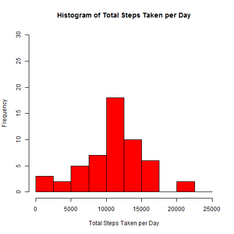
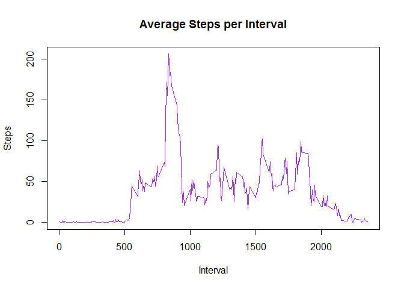
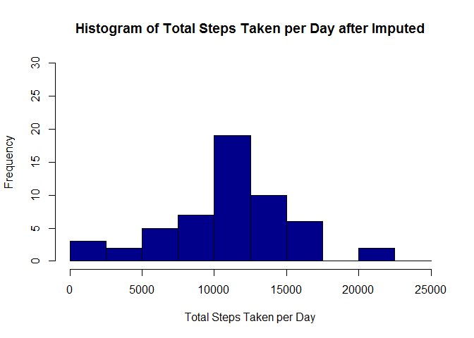
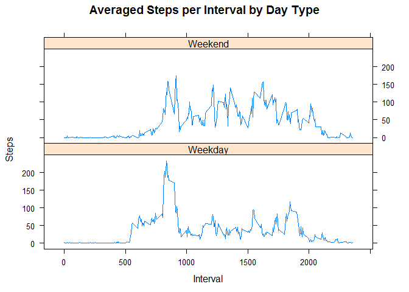

# Reproducible Research: Peer Assessment 1
Intan Dea Yutami  
October 29, 2017  


## Loading and preprocessing the data

After extracting the zip file, we will get activity.csv. Then, we have to load/read the file. Below is the code chunk to read it.


```r
if (!exists("activity")){
  activity <- read.csv("activity.csv")
}

sum_day <- aggregate(steps ~ date, activity, sum)
```

## What is mean total number of steps taken per day?

First, we sum all the steps taken each day. Then we plot its histogram and show its median and mean.


```r
sum_steps_day <- aggregate(steps ~ date, activity, sum)
hist(sum_steps_day$steps, 
     main = "Histogram of Total Steps Taken per Day",
     xlab = "Total Steps Taken per Day",
     ylab = "Frequency",
     col ="red",
     ylim = c(0,30),
     breaks = seq(0,25000,2500)
)
```

<!-- -->

Here are the following code to show the mean and median.


```r
summary(sum_steps_day$steps)
```

```
##    Min. 1st Qu.  Median    Mean 3rd Qu.    Max. 
##      41    8841   10765   10766   13294   21194
```

## What is the average daily activity pattern?

Here is the code chunk to earn average daily activity pattern. Steps across each days are averaged within the same interval. Later, a plot showing relationship between interval and averaged steps is shown.


```r
daily_pattern <- aggregate(steps ~ interval, activity, mean)
plot(daily_pattern$interval,
     daily_pattern$steps,
     type = "l",
     col = "purple",
     main = "Average Steps per Interval",
     xlab = "Interval",
     ylab = "Steps"
)
```

<!-- -->

The interval which step is the maximum value is:


```r
daily_pattern[which.max(daily_pattern$steps),]$interval
```

```
## [1] 835
```

## Imputing Missing Values

Below is total row with missing Values.

```r
sum(is.na(activity$steps))
```

```
## [1] 2304
```

Each missing values will be substituted with average steps from related interval and this new table will be assigned to a new variable.

```r
imputed_activity <- 
      transform(activity, 
                 steps = ifelse(
                          is.na(activity$steps), 
                          daily_pattern[daily_pattern$interval == activity$interval,]$steps, 
                          activity$steps
                        )
                )
sum_steps_imputed <- aggregate(steps ~ date, imputed_activity, sum)
```

Next, the imputed data will be summarized in histogram, and its mean and median value will be given.


```r
hist(sum_steps_imputed$steps, 
     main = "Histogram of Total Steps Taken per Day after Imputed",
     xlab = "Total Steps Taken per Day",
     ylab = "Frequency",
     col ="darkblue",
     ylim = c(0,30),
     breaks = seq(0,25000,2500)
)
```

<!-- -->

```r
summary(sum_steps_imputed$steps)
```

```
##    Min. 1st Qu.  Median    Mean 3rd Qu.    Max. 
##      41    8860   10766   10766   13191   21194
```

The mean value before and after imputed is 10766, so there is no change. Meanwhile, the median value is shifted from 10765 before imputed to be 10766. The impact of imputing data is more visible to median.

## re there differences in activity patterns between weekdays and weekends?

In this step we are observing if there is any pattern difference between activities done in Weekend and Weekdays. A new column (dayType) is inserted to inform if that row was occured in weekend or weekday. After that, the total steps are averaged across interval and day type. The plot below shows pattern of averaged steps per interval for weekend and weekday.

```r
imputed_activity$date <- strptime(imputed_activity$date,"%Y-%m-%d")
imputed_activity$dayType <- 
    factor(
      ifelse
      (
          weekdays(imputed_activity$date) == 'Sunday' | 
          weekdays(imputed_activity$date) == 'Saturday',
          "Weekend",
          "Weekday"
      )
    )

agg_dayType <- aggregate(steps ~ interval + dayType, imputed_activity, mean)
library(lattice)
xyplot(steps ~ interval | dayType, 
       data = agg_dayType, 
       layout = c(1,2), 
       type ="l",
       main = "Averaged Steps per Interval by Day Type",
       xlab = "Interval",
       ylab = "Steps"
)
```

<!-- -->

On weekday, we can find that in interval of around 750 - 900, there is a dominant peak (around 240) and no other strong peak is found in the rest of the graphic. Meanwhile, no such strong peak is found in weekdays. Peaks are scattered around 100-200.
